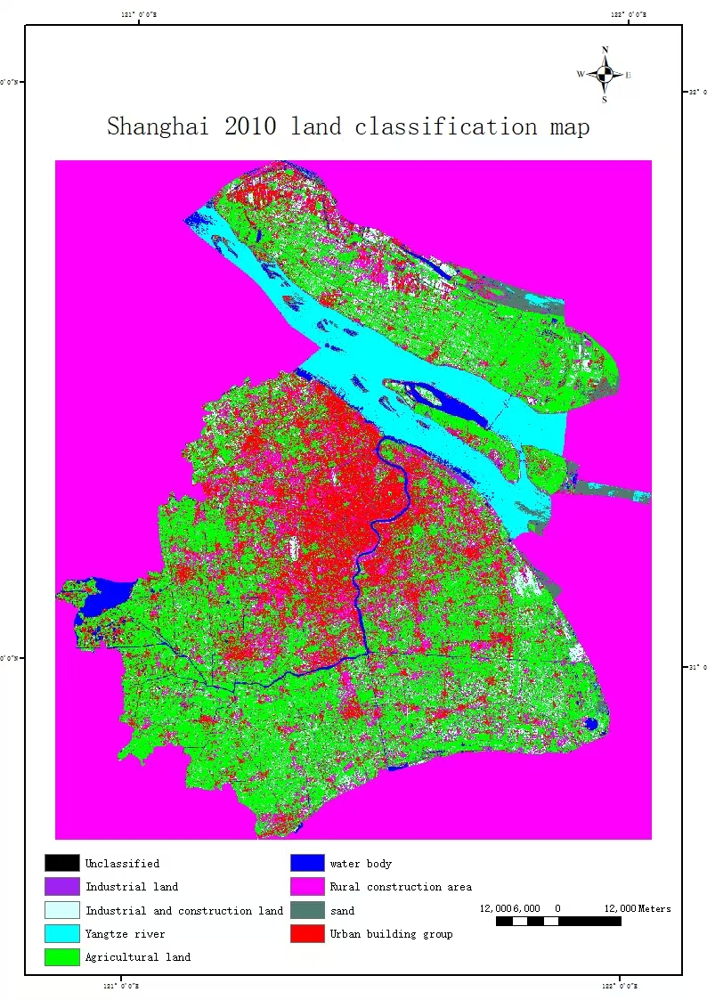
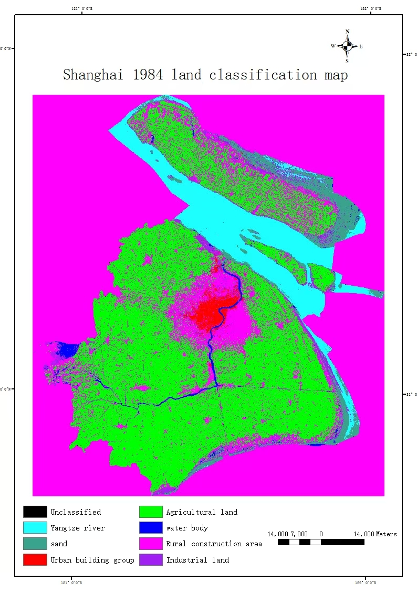

# 个人网站模板修改指南

本文档详细说明如何修改网站各个部分的内容。所有需要修改的位置在 `index.html` 文件中都已用 `★★★` 标记出来，方便快速定位。

---

## 📋 目录

1. [页面基本信息](#1-页面基本信息)
2. [导航栏](#2-导航栏)
3. [Header部分（头部）](#3-header部分头部)
4. [作品集部分](#4-作品集部分)
5. [About部分](#5-about部分)
6. [Footer部分（页脚）](#6-footer部分页脚)
7. [项目模态框详情](#7-项目模态框详情)

---

## 1. 页面基本信息

### 修改位置1：页面标题（浏览器标签页显示）

**位置：** 第12行  
**代码：**
```html
<title>Freelancer - Yourname Theme</title>
```

**修改方法：**
- 将 `Freelancer - Yourname Theme` 替换为你的网站标题
- 例如：`<title>张三的个人网站</title>`

---

## 2. 导航栏

### 修改位置2：导航栏左上角品牌名称

**位置：** 第44行  
**代码：**
```html
<a class="navbar-brand" href="#page-top">FANG Zuteng</a>
```

**修改方法：**
- 将 `FANG Zuteng` 替换为你的名字
- 例如：`<a class="navbar-brand" href="#page-top">张三</a>`

---

## 3. Header部分（头部）

### 修改位置3：头像图片路径

**位置：** 第71行  
**代码：**
```html

```

**修改方法：**
1. 将你的头像图片放到 `img/` 目录下
2. 修改 `src="img/profile.png"` 为你的图片路径
3. 例如：``
4. **支持的图片格式：** `.png`, `.jpg`, `.jpeg`, `.gif`
5. **建议尺寸：** 正方形，建议 400x400 像素或更大

---

### 修改位置4：Header部分 - 姓名/标题（大标题）

**位置：** 第73行  
**代码：**
```html
<span class="name">这里是标题 FANG Zuteng | Applied Remote Sensing |  University of Miami</span>
```

**修改方法：**
- 将内容替换为你的姓名和标题
- 例如：`<span class="name">你好！我是张三 | Web开发者 | 北京理工大学</span>`
- 支持使用 `|` 分隔多个信息
- 支持中英文

---

### 修改位置5：Header部分 - 技能描述（详细介绍）

**位置：** 第75-80行  
**代码：**
```html
<span class="skills">这里填技能I am a geospatial analyst...</span>
```

**修改方法：**
- 将内容替换为你的技能和详细介绍
- 可以使用 `<br/>` 标签换行
- 支持多段文字
- 例如：
```html
<span class="skills">
    我是一名全栈开发工程师，擅长前端和后端开发。
    <br/>精通 React、Vue、Node.js 等技术栈。
    <br/>拥有5年的开发经验，参与过多个大型项目。
</span>
```

---

## 4. 作品集部分

### 修改位置6：作品集部分标题

**位置：** 第92行  
**代码：**
```html
<h2>My Projects</h2>
```

**修改方法：**
- 将 `My Projects` 替换为你想要的标题
- 例如：`<h2>我的项目</h2>` 或 `<h2>作品集</h2>`

---

### 修改位置7-11：作品集首页缩略图

**位置：** 
- 项目1：第104行
- 项目2：第114行
- 项目3：第124行
- 项目4：第134行
- 项目5：第144行

**代码示例（项目1）：**
```html

```

**修改方法：**
1. 将图片文件放到对应的项目文件夹中（`img/project1/`, `img/project2/` 等）
2. 修改 `src` 属性为你的图片路径
3. **默认使用各项目的第一张图片作为缩略图**
4. 例如项目1：``
5. **支持的图片格式：** `.png`, `.jpg`, `.jpeg`, `.gif`
6. **建议尺寸：** 正方形，建议 600x600 像素或更大

---

## 5. About部分

### 修改位置12：About部分 - 左侧介绍文字

**位置：** 第162行  
**代码：**
```html
<p>底部左侧在这里填写介绍</p>
```

**修改方法：**
- 替换为你的个人介绍（左侧）
- 例如：`<p>我是一名来自北京的Web开发者，专注于前端开发和用户体验设计。拥有5年的开发经验，参与过多个大型项目。</p>`

---

### 修改位置13：About部分 - 右侧介绍文字

**位置：** 第164行  
**代码：**
```html
<p>底部右侧在这里填写介绍</p>
```

**修改方法：**
- 替换为你的兴趣爱好或其他介绍（右侧）
- 例如：`<p>我喜欢摄影、阅读和旅行。在业余时间，我会探索新的技术栈，并参与开源项目。</p>`

---

## 6. Footer部分（页脚）

### 修改位置14：Footer - Location（地址信息）

**位置：** 第184-185行  
**代码：**
```html
<p>Your hostel address line 1
    <br>Your hostel address line 2</p>
```

**修改方法：**
- 将地址信息替换为你的实际地址
- 使用 `<br>` 标签换行
- 例如：
```html
<p>北京市海淀区中关村大街1号
    <br>邮编：100000</p>
```

---

### 修改位置15：Footer - Around the Web（社交媒体链接）

**位置：** 第190-204行  
**代码：**
```html
<ul class="list-inline">
    <li>
        <a href="#" class="btn-social btn-outline"><i class="fa fa-fw fa-facebook"></i></a>
    </li>
    <li>
        <a href="#" class="btn-social btn-outline"><i class="fa fa-fw fa-google-plus"></i></a>
    </li>
    <!-- ... 更多社交媒体图标 ... -->
</ul>
```

**修改方法：**
1. **修改链接：** 将 `href="#"` 替换为你的社交媒体链接
   - 例如：`<a href="https://www.linkedin.com/in/yourname" ...>`
2. **删除不需要的图标：** 如果某个社交媒体你不需要，可以删除整个 `<li>...</li>` 块
3. **添加其他图标：** 可以复制一个 `<li>` 块，修改 `fa-xxx` 类名为其他 Font Awesome 图标
4. **常用图标类名：**
   - `fa-github` - GitHub
   - `fa-linkedin` - LinkedIn
   - `fa-twitter` - Twitter
   - `fa-facebook` - Facebook
   - `fa-instagram` - Instagram
   - `fa-envelope` - 邮箱

**示例：**
```html
<ul class="list-inline">
    <li>
        <a href="https://github.com/yourname" class="btn-social btn-outline"><i class="fa fa-fw fa-github"></i></a>
    </li>
    <li>
        <a href="https://www.linkedin.com/in/yourname" class="btn-social btn-outline"><i class="fa fa-fw fa-linkedin"></i></a>
    </li>
    <li>
        <a href="mailto:yourname@example.com" class="btn-social btn-outline"><i class="fa fa-fw fa-envelope"></i></a>
    </li>
</ul>
```

---

### 修改位置16：Footer - 你的名字/网站名称

**位置：** 第208-209行  
**代码：**
```html
<h3>Yourname</h3>
<p><a href="http://startbootstrap.com">Yourname</a>.</p>
```

**修改方法：**
- 将 `Yourname` 替换为你的名字或网站名称
- 修改链接 `href="http://startbootstrap.com"` 为你的网站链接（如果有）
- 例如：
```html
<h3>张三</h3>
<p><a href="https://www.yourwebsite.com">张三的个人网站</a>.</p>
```

---

### 修改位置17：Footer - 版权信息

**位置：** 第218行  
**代码：**
```html
Copyright &copy; Your Website 2016
```

**修改方法：**
- 将 `Your Website 2016` 替换为你的网站名称和年份
- 例如：`Copyright &copy; 张三的个人网站 2024`
- `&copy;` 是版权符号 © 的HTML代码

---

## 7. 项目模态框详情

每个项目都有5个需要修改的位置：标题、图片、描述、Client/Date/Service信息。

### 项目1（portfolioModal1）

#### 修改位置18：项目1模态框 - 项目标题
**位置：** 第246行  
**代码：**
```html
<h2>Project 1</h2>
```
**修改方法：** 替换为你的项目名称，例如：`<h2>上海土地利用演变分析</h2>`

#### 修改位置19：项目1模态框 - 项目图片
**位置：** 第249-250行  
**代码：**
```html


```

**修改方法：**
1. **添加图片：** 复制一行 `` 标签，修改 `src` 路径
2. **图片间距：** 从第二张图片开始，添加 `style="margin-top: 20px;"` 来分隔图片
3. **示例：**
```html


```
4. **删除图片：** 删除不需要的 `` 标签行

#### 修改位置20：项目1模态框 - 项目描述文字
**位置：** 第251-256行  
**代码：**
```html
<p>
    Geospatial Data Processing & Spatial Change Analysis: Shanghai Land Use Evolution
    ...
</p>
```
**修改方法：** 替换为你的项目详细描述

#### 修改位置21：项目1模态框 - Client/Date/Service信息
**位置：** 第259-272行  
**代码：**
```html
<ul class="list-inline item-details">
    <li>Client: <strong>Yourname</strong></li>
    <li>Date: <strong>April 2014</strong></li>
    <li>Service: <strong>Web Development</strong></li>
</ul>
```

**修改方法：**
- **Client：** 替换为项目客户或机构名称
- **Date：** 替换为项目完成日期
- **Service：** 替换为项目类型或服务内容
- 例如：
```html
<ul class="list-inline item-details">
    <li>Client: <strong>University of Miami</strong></li>
    <li>Date: <strong>2023年</strong></li>
    <li>Service: <strong>遥感数据分析</strong></li>
</ul>
```

---

### 项目2（portfolioModal2）

#### 修改位置22：项目2模态框 - 项目标题
**位置：** 第293行  
**修改方法：** 同项目1

#### 修改位置23：项目2模态框 - 项目图片
**位置：** 第296-305行  
**修改方法：** 同项目1，注意修改路径为 `img/project2/`

#### 修改位置24：项目2模态框 - 项目描述文字
**位置：** 第306-318行  
**修改方法：** 同项目1

#### 修改位置25：项目2模态框 - Client/Date/Service信息
**位置：** 第319-332行  
**修改方法：** 同项目1

---

### 项目3（portfolioModal3）

#### 修改位置27：项目3模态框 - 项目标题
**位置：** 第353行  
**修改方法：** 同项目1

#### 修改位置28：项目3模态框 - 项目图片
**位置：** 第356-361行  
**修改方法：** 同项目1，注意修改路径为 `img/project3/`，注意项目3第一张图片是 `.png` 格式

#### 修改位置29：项目3模态框 - 项目描述文字
**位置：** 第362-376行  
**修改方法：** 同项目1

#### 修改位置30：项目3模态框 - Client/Date/Service信息
**位置：** 第377-390行  
**修改方法：** 同项目1

---

### 项目4（portfolioModal4）

#### 修改位置32：项目4模态框 - 项目标题
**位置：** 第411行  
**修改方法：** 同项目1

#### 修改位置33：项目4模态框 - 项目图片
**位置：** 第414-415行  
**修改方法：** 同项目1，注意修改路径为 `img/project4/`

#### 修改位置34：项目4模态框 - 项目描述文字
**位置：** 第416-422行  
**修改方法：** 同项目1

#### 修改位置35：项目4模态框 - Client/Date/Service信息
**位置：** 第423-436行  
**修改方法：** 同项目1

---

### 项目5（portfolioModal5）

#### 修改位置37：项目5模态框 - 项目标题
**位置：** 第564行  
**修改方法：** 同项目1

#### 修改位置38：项目5模态框 - 项目图片
**位置：** 第569-570行  
**修改方法：** 同项目1，注意修改路径为 `img/project5/`

#### 修改位置39：项目5模态框 - 项目描述文字
**位置：** 第574-579行  
**修改方法：** 同项目1

#### 修改位置40：项目5模态框 - Client/Date/Service信息
**位置：** 第580-593行  
**修改方法：** 同项目1

---

## 📝 修改技巧

### 1. 如何快速定位修改位置
- 在 `index.html` 文件中搜索 `★★★` 可以快速找到所有需要修改的位置
- 每个位置都有明确的注释说明

### 2. 图片处理建议
- **图片格式：** 推荐使用 `.jpg` 或 `.png` 格式
- **图片大小：** 建议压缩图片以加快网页加载速度
- **图片命名：** 使用英文和数字，避免中文和特殊字符
- **图片路径：** 确保路径正确，相对于 `index.html` 文件的位置

### 3. 文字编辑建议
- **换行：** 使用 `<br/>` 或 `<br>` 标签
- **加粗：** 使用 `<strong>文字</strong>` 或 `<b>文字</b>`
- **链接：** 使用 `<a href="链接地址">链接文字</a>`
- **特殊字符：** 
  - `&copy;` = ©
  - `&nbsp;` = 空格
  - `&amp;` = &

### 4. 添加/删除项目
- **添加项目：** 复制一个完整的项目模态框代码块，修改ID和内容
- **删除项目：** 删除对应的缩略图和模态框代码块

---

## ⚠️ 注意事项

1. **备份文件：** 修改前建议先备份 `index.html` 文件
2. **编码格式：** 确保文件保存为 UTF-8 编码，以支持中文显示
3. **路径检查：** 修改图片路径后，确保图片文件确实存在于指定位置
4. **语法检查：** 修改HTML代码时注意保持标签的完整性，不要遗漏闭合标签
5. **浏览器测试：** 修改后在不同浏览器中测试显示效果

---

## 🆘 常见问题

### Q: 图片不显示怎么办？
A: 检查以下几点：
1. 图片路径是否正确（相对于 index.html）
2. 图片文件名是否正确（注意大小写）
3. 图片文件是否存在
4. 图片格式是否支持

### Q: 中文显示乱码怎么办？
A: 确保文件保存为 UTF-8 编码格式

### Q: 如何添加更多项目？
A: 
1. 在作品集网格部分添加新的缩略图
2. 添加对应的模态框代码
3. 确保ID唯一（portfolioModal1, portfolioModal2...）

### Q: 如何修改网站颜色和样式？
A: 需要修改 `css/freelancer.css` 文件，本文档不涉及CSS修改

---

## 📞 技术支持

如有问题，请检查：
1. HTML语法是否正确
2. 文件路径是否正确
3. 图片文件是否存在
4. 浏览器控制台是否有错误信息

---

**最后更新：** 2024年  
**文档版本：** 1.0
